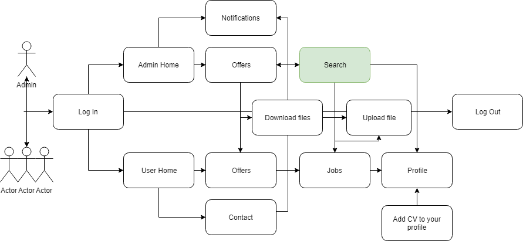

# Final-project

## Introduction
My final project is an app for a internal translations auction. Only if you have passed the test could be register, so it´s a private app.

The main object is that translators have the access to the translations and avoid to call them and look for the appropiate person, we have a qualified translators that could check the job and offer their services if they have availability.

## Funtional description
This project is based on a selected group of translators, that had passed the test translations, that are known by the company. 

As **Admin** you are able to create *new offers* under the **Offers section** so the translators that have this specific language combination could see the offers and apply for them. Once they apply and book and offer the *original translation file* appear in the offer, so they could download it and start working. And see the offers publish in the last month.
Once that you published the job, if some of the translators had booked it, the offer would appear as locked and the original file would be visible for them.
You could also see and *download the final translated document* for the offer field.
You would *receive messages* from the translators, that you could see in the **Notifications section**. 
The **Search section** is under construction, but would allow you to filter jobs by delivery date, by translator, by any field that you´ll consider that could be important.

As **User** you are able to see the *new offers* that could fit your profile. From the **Offers section** you could see any offer published in the last month that could be relevant for you, and from there you could book it and if you do so, download the original file to start working.
In the **Job section** you´ll find all the jobs that you had book in the last month, and you are able to upload your final translation in the same section. The jobs appear as Done if the delivery date is earlier than today´s date, or Ongoing if the date is later.
In the **Contact section** you could contact us with your doubts or queries, and leave your phone number to solve it quicker.
In the **Profile section** you could update your personal and professional data, and upload your CV if you´d like.

## Funtional description map

## Technical description
This Final project is designed for laptop devises. The front is created using ReactJs, the back is based on Firebase for the storaged using Redux for the data management.
Written in Javascript, with some feature of ES6.
The design is implemented with SASS.

## Block diagram map
    
    ### Component diagram

    ### Data model diagram

## Appi test coverage
Here you could see the test that I have done with my Appi.